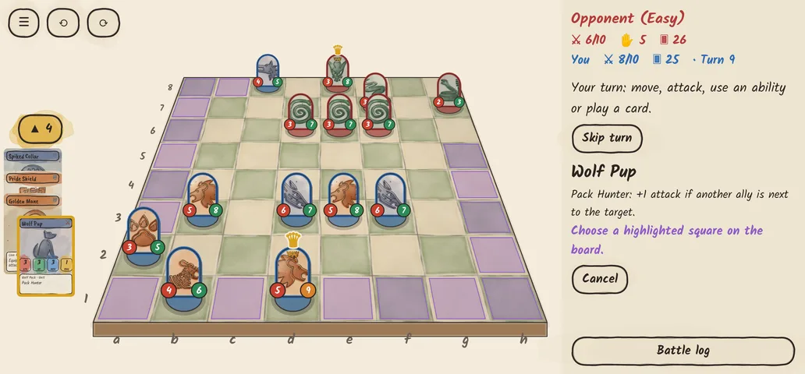
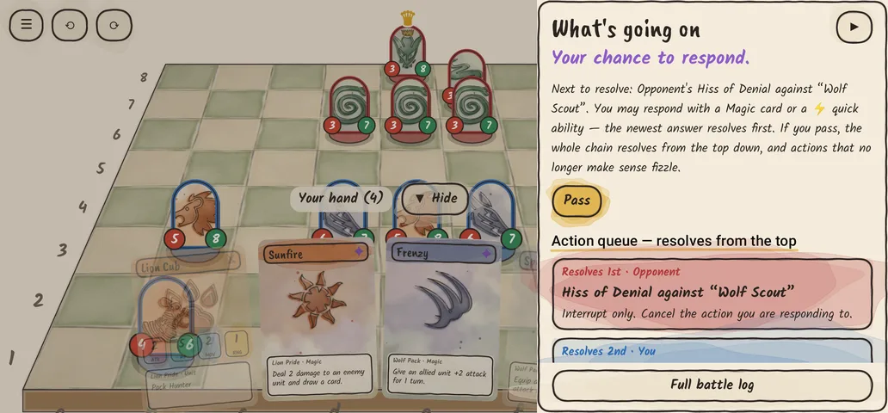
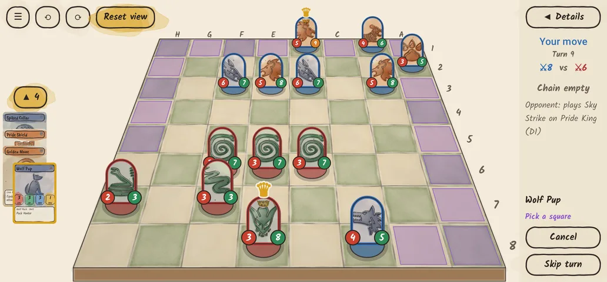

# King of the Beasts

A 2.5D card–chess hybrid for Android. Build a 40-card deck from up to three animal
races, deploy your army on a chessboard, and battle to bring down the enemy King.
The art is hand-drawn ink over watercolor washes.

> Status: **playable MVP**. You play against the computer (Beginner, Pro or Master) or a friend, over the internet or on the same Wi-Fi.

<p>


</p>
<p>


</p>
<p>


</p>


## How to play

| | |
|---|---|
| **Goal** | Kill the enemy King. If your King dies, you lose. |
| **Deck** | **40 cards plus one King**, from 1–3 races. Copies per card follow its stars: ★ cards up to 3, ★★ up to 2, ★★★ just 1. At most **3 Strategy cards**. The King's race gives the whole army its **racial trait** (see below). At most **3 Champions** per deck. |
| **Card types** | **Unit** (a piece on the board): ★ normal, ★★ **Elite**, ★★★ **Champion**. **Magic** (buff, heal, damage, stun, counter, move or swap units — usable as interrupts), ranked ★ to ★★★. **Strategy**: a powerful **field** — only one field is on the battlefield at a time and it stays until any Strategy card (yours or your opponent's) replaces it. **Equipment** (permanent unit upgrades). Each type has its own frame: **brown studded** units (**gold** for Kings), **violet starred** Magic, **teal** Strategy with a pennant, **steel riveted** Equipment. |
| **Deployment** | Coin flip picks who starts. Players alternate placing one unit in their **first 3 rows**, up to 6 each. The King is always placed first. Units are chosen from all unit cards in the deck. Then everyone shuffles and draws 5. |
| **Battle** | Draw a card (hand up to **10**), then take **one** action: move, attack, use a unit ability, or play a card. **Kings and Champions** that fight in melee may **move and then attack** in the same turn; every other unit (and every ranged unit) moves or attacks. **Quick** spells don't use your action. Movement is up to MOV steps in 8 directions (flyers pass over units); range counts diagonals. Battles last about 40 turns on average. |
| **Turn timer** | Online battles give each decision **20 seconds**; when it runs out you pass (or a unit is placed for you during deployment). No timer against the computer. |
| **Structures** | Unit cards that never move or attack by themselves: **Sentry** towers fire at the weakest enemy in range each turn, **Taunt** walls (high health) force adjacent enemies to attack them or move away, and **Mending Aura** totems heal adjacent allies by 2 each turn. 1–2 per race. |
| **Evolution** | **EVOLVES** units turn into a stronger form after surviving some of your turns or defeating enemies — some evolve twice. Evolving heals fully and keeps equipment; evolved forms can't be put in decks. 2 per race. |
| **Reinforcements** | Unit cards played in battle go on an empty **edge** square at least **2 squares** from every enemy. Each side has **16 unit slots** (22 for an Endless Horde): **Champions** take 3 slots, **Elite** units 2, other units 1 and the King none. Summoned and enthralled units count too. |
| **Kings** | Kings are tough (28–35 health) but mostly weak fighters — rule engines to protect behind a wall of units; only the Pride King and Alpha Wolf hit hard. They take **no damage from Magic cards or abilities** (attacks, Retaliate and Exhaustion still hurt them) and are **Immovable**: nothing can push, swap or replace them. |
| **Used cards** | **Exhausted** (out of the game once used): unit cards, equipment, Strategy cards, and spells that deal damage or summon units. **Discarded** (they come back): other Magic cards go to the discard pile, which is shuffled into a new deck when your deck runs out. |
| **Exhaustion** | From turn 120 each King loses health at the start of its owner's turn (1, +1 every 20 turns) and can't be healed, so every battle ends. |
| **Interrupts** | Any action can be answered with a Magic card or a ⚡ interrupt ability. The other player can answer that, and so on. The chain then resolves last-in-first-out, and actions that no longer make sense fizzle. |
| **Displacement spells** | Every race has one Magic card that moves or swaps units: **Pack Relay** (Wolf: send an ally back into your deck, a random unit from your deck takes its square), **Mighty Shove** (Bear: push an enemy 2 squares away from your nearest unit, 2 damage if something stops it), **Gale Force** (Hawk: blow an enemy up to 3 squares back toward its own side), **Mirage** (Serpent: send an enemy back into its owner's deck, a random unit from that deck takes its square), **Rally to the King** (Lion: an ally moves next to your King) and **Rat Run** (Vermin: an enemy swaps squares with your nearest unit). |
| **Keywords** | **Hidden**: can only be attacked or targeted from a square next to it. **Backstab**: +2 attack when attacking from behind (from the target's own side). **Brood**: a Swarm Rat pops out next to it at the start of your next 2 turns. **Arrival**: happens when the unit is played (e.g. two Swarm Rats appear). **Immovable**: can't be pushed, swapped or replaced. **Champions** (★★★): two per race (three for the unit-focused Wolf Pack), the strongest units — 3 unit slots, 1 copy per deck. |
| **Inspecting** | Press and hold any card (in your hand, in the deck builder) or any unit on the board. It opens large, with every trait, ability, target, range and cooldown spelled out. Units also show their live stats and effects. |
| **Decks** | Build and save your own decks, and edit them any time (tap a deck). Starter decks can be opened read-only with **View**, or copied to edit with **Copy**. |
| **Board view** | Tap **2D** (top left in battle) for a flat top-down board with round tokens, or **2.5D** to go back to the perspective view with standing pieces. Also in Settings; the choice is remembered. Turning the board works in both views. |
| **Controls** | The game plays in landscape. When it is your move your hand fans out in front of the board. Pick a card and it tucks into a strip on the left while you choose a highlighted square. Swipe the hand down or tap **Hide** to see the board, and tap the strip (or swipe it right) to bring the cards back. **⟲ / ⟳** turn the board 90° (a two-finger twist turns it freely), and **Reset view** puts your side back at the bottom. The rail on the right shows whose move it is, the action queue (the interrupt chain, next to resolve on top) and the buttons you need now; tap **◀ Details** or swipe it left to pull out a drawer that explains what is going on, what each queued action will do, both armies, active battlefield rules and recent events. |
| **Opponents** | **Beginner** plays on instinct: it takes its best-looking move only half the time and otherwise one of its next four, and often misses chances to interrupt. **Pro** thinks 2 moves ahead (its move and your best reply) and thinks one move past an interrupt before answering. **Master** searches as deep as its thinking time allows (about 1.5 s per move) and looks ahead before interrupting; in testing it beat Pro in 62% of 48 games. None of them peek at your hand. |
| **Animations** | Every action plays out on the board: melee units lunge at their target, archers loose arrows, spells and abilities fly as glowing orbs and burst on impact (orange harms, green helps, violet controls), hit units shake and flash red, fallen units topple and fade, played cards fly in from their owner's side, new units drop onto the board, and Strategy cards wash the whole board in their colour. |
| **Tutorial** | A guided first battle (offered on first launch, and under **Play** and **How to Play**). A coach note teaches one thing at a time — deploying, moving, answering an attack with a Magic card, the action queue, Magic, attacking, Strategy fields — and only the move being taught lights up, until you defeat the rival's King. **▲ Hide** folds the note into a small tab (it also folds by itself when you pick a card or unit); tap the tab to read it again. |
| **Menu** | **Play** opens the play options: **Continue** (your battle in progress), **New game** (against the AI), **Tutorial** and **With friends** (online), with **Back** to the main menu. The **⚙** wheel in the top corner opens Settings. |
| **With friends** | Online play, two ways. **Internet:** one player taps **Host a game** and gets a 5-letter code, the other types it under **Join**; works on Wi-Fi or mobile data through a tiny free relay server (no account). **Same Wi-Fi / hotspot:** peer to peer with no internet at all; one player taps **Host a game**, the other **Join a game** and picks it from the list (or types the address the host shows). This also works when one phone shares a hotspot and the other joins it. Both phones run the battle; only moves travel, and a checksum after every action makes sure both copies agree. Rematch after a battle. If the connection drops, the battle waits and reconnects by itself; **Leave for now** keeps it saved so you can both **Rejoin** it later from With friends (even after closing the app). **Forfeit** hands your friend the win. Both need the same app version. |
| **Continue** | Battles are saved after every move. Leave a battle (or close the app) and **Play → Continue** picks it up; **Forfeit** ends it for good. |
| **Sound** | Medieval background music (menu, battle, victory and defeat themes) and sound effects for every action: swords, arrows, hits, falls, spells, cards and turns. All CC0, see [CREDITS.md](CREDITS.md). |
| **Profile** | Tap your name and picture at the top of the main menu. Your name is the one friends see online; your picture is the King you've played most. It shows your win rates against Beginner, Pro and Master and against friends, your favourite race and King, results by race, and every finished battle (result, Kings, turns, date). Giving up counts as a loss, a friend giving up as a win. **Clear** starts the history over. |
| **Settings** | Music and sound effect volume, animation speed (Slow / Normal / Fast, also paces the AI), and keeping the screen on during battles. Open it from the ⚙ wheel on the main menu or during a battle. |

### Races, racial traits and Kings

| Race | Style | Racial trait (army led by this race's King) | King 1 | King 2 |
|---|---|---|---|---|
| 🐺 Wolf Pack | speed, pack attacks | **Pack Tactics**: all your units have Pack Hunter and +1 movement | **Alpha Wolf** – *Call the Pack*: a Wolf Pup joins at the start of each of your turns (up to 2) | **Moon Howler** – *Bloodthirst*: every enemy death heals it and adds +1 attack |
| 🐻 Bear Clan | toughness, regeneration | **Thick Fur**: +1 health, but units with 3+ movement get −1 movement | **Elder Bear** – *Unstoppable*: can't be stunned, takes ≤3 per hit; *Earthshaker Roar* | **Cave Warden** – *Guardian*: adjacent allies take 1 less damage; regenerates |
| 🦅 Hawk Aerie | flying, range | **Eagle Eyes**: ranged units (range 2+) get +1 range | **Sky Sovereign** – *Change of Winds*: instantly swap places with any ally (interrupt!) | **Storm Eagle** – *Tempest* zaps a random non-King enemy within 3 squares every turn; *Lightning Strike* stun |
| 🐍 Serpent Coil | poison, denial | **Venom Blood**: all units Poisonous, but units with 3+ attack get −1 attack | **Naga Queen** – *Enthrall*: steal a weakened enemy unit | **Basilisk** – *Petrifying Gaze*: everything it bites is stunned |
| 🦁 Lion Pride | leadership, buffs | **Royal Pride**: King +1 health and +1 attack | **Pride King** – *Commander*: allies within 3 get +1 attack | **Lioness Queen** – *Pounce*: leap across the board and strike |
| 🐀 Vermin Horde | hiding, backstabs, swarms | **Endless Horde**: 22 unit slots instead of 16 | **Rat King** – *Call the Mischief*: two Swarm Rats appear next to him | **Blight Seer** – Hidden; *Blight Bolt* hurts the target and everything around it, friend or foe |

## Project layout

```
core/        Pure Kotlin rules engine (no Android): cards, deck rules, game engine, AI. JVM unit tests.
app/         Android app (Jetpack Compose): menus, deck builder, 2.5D battle screen.
tools/art/   Python generator for the watercolor card art, board texture and launcher icon.
docs/        Design notes and plan.
```

* **Engine** (`core/.../game/GameEngine.kt`): deterministic and action-based. The same seed and the same
  actions always produce the same game, which is what online play and resuming build on.
* **Online play** (`core/.../net/NetProtocol.kt`, `app/.../net`): JSON lines between the two phones over a
  small `Link` interface. On the same Wi-Fi it's a TCP socket, with games found by Network Service Discovery;
  over the internet it's a WebSocket through the relay in `server/` (a Cloudflare Worker that pairs two
  phones by room code and passes messages through; see [server/README.md](server/README.md)). The host picks
  the seed; each side sends its own actions with a checksum of the whole game state, and the other side checks
  the move is legal and the checksums match.
* **AI** (`core/.../ai`): positions are scored on material, King safety, next-turn threats and board advance.
  *Beginner* picks the best-looking action one step ahead, with some noise. *Pro* runs a 2-ply
  search (its action → your reply → its action) over the most promising candidates at each level. It
  doesn't peek at your hand: when predicting your reply it only considers board actions. Both interrupt
  only when it clearly pays off. *Master* deepens the same search one ply at a time (wider beams, best moves
  first from the previous pass) until its time budget runs out, so it adapts to the phone's speed, and searches
  two plies past an interrupt chain before answering. A test checks that Pro beats Beginner.
* **2.5D board** (`app/.../game/BoardView.kt`): a perspective projection of the board plane. The watercolor
  board texture is mapped with a homography, units are upright card standees sorted by depth, and taps
  are mapped back through the inverse projection.
* **Cards** (`core/.../data/CardDatabase.kt`): all 272 cards are data (254 for decks, plus 18 evolved forms). New cards are usually one line,
  built from the effect primitives in `model/Cards.kt`.

## Balance

The cards are balanced with simulations and statistics. The AI plays itself thousands of times with
generated decks for every race combination. A Bradley–Terry regression turns the results into Elo
strengths, and paired "what if" experiments measure what each stat is worth. A ridge least-squares
solve then sizes the changes. Every race now wins 49.0–52.5% of its games, every King 46.8–54.7% and every starter deck 45.0–54.6%
(target: 44–55%).
See [docs/BALANCING.md](docs/BALANCING.md) for the method and changelog, and
[docs/BALANCE.md](docs/BALANCE.md) for the full numbers.

```bash
./gradlew :core:balanceReport -Pgames=4000   # regenerate docs/BALANCE.md
```

## Champions

Champions (and Kings) are the only units that can move and then attack in the same turn.

| Race | Champion 1 | Champion 2 |
|---|---|---|
| 🐺 Wolf Pack | **Ironjaw Packlord** 4/10 – arrives with two Wolf Pups | **Midnight Fang** 4/8 – Hidden, Backstab; and **Fenrir the Devourer** 4/9 – Bloodthirst |
| 🐻 Bear Clan | **Ancient Cave Bear** 5/13 – Armored, Immovable, Regenerate | **Quakeback Bear** 5/12 – Armored; Ground Slam hits every adjacent enemy for 2 |
| 🦅 Hawk Aerie | **Thunderbird** 4/10, range 3 – Flying; Thunderclap stuns | **Storm Griffin** 5/9 – Flying, Armored |
| 🐍 Serpent Coil | **Great Hydra** 5/12 – Poisonous, Regenerate; Many Heads | **Stone-Eyed Gorgon** 5/11, range 2 – Poisonous; Stony Glare stuns 2 turns |
| 🦁 Lion Pride | **Sunmane Paragon** 5/9 – Armored, Retaliate; Golden Roar | **Sunfire Chimera** 5/10 – Retaliate; Fire Breath |
| 🐀 Vermin Horde | **Blightspawn Colossus** 4/10 – arrives with two Swarm Rats | **Warren Matriarch** 4/12 – Brood, Regenerate; arrives with three Swarm Rats |

## Building

Requirements: JDK 17+ and the Android SDK (API 35).

```bash
./gradlew :core:test            # rules engine tests (incl. AI-vs-AI soak test)
./gradlew :app:assembleDebug    # APK at app/build/outputs/apk/debug/KingOfTheBeasts-<version>-dev.apk
```

Every build is signed with the fixed test key in `app/signing/debug.keystore` (unless CI has a private release
key in its secrets), and the version code comes from the version name (0.5.0 → 500). So a newer APK always
installs as an update over an older one — no need to uninstall.

## CI/CD (GitHub Actions)

`.github/workflows/android.yml`:

* **Every push and pull request** runs the engine unit tests and Android lint, then builds a debug APK.
  The APK is attached to the workflow run as an artifact you can download and install.
* **Pushing a tag `vX.Y.Z`** builds a release APK (`KingOfTheBeasts-X.Y.Z.apk`) and publishes it as a GitHub Release.
  To sign it with your own key, add these repository secrets:
  `ANDROID_KEYSTORE_BASE64` (`base64 -w0 release.jks`), `ANDROID_KEYSTORE_PASSWORD`,
  `ANDROID_KEY_ALIAS`, `ANDROID_KEY_PASSWORD`. Without them the release APK is signed with a debug key,
  which is fine for testing but not for the Play Store.
* Dependabot keeps Gradle dependencies and Actions up to date.

```bash
git tag v0.1.0 && git push origin v0.1.0   # cut a release
```

Or, without git: on GitHub open **Actions → Android CI/CD → Run workflow** and enter a version
(e.g. `0.3.0`). The pipeline creates the tag `v0.3.0` and the release with the APK.
Versions and what changed in each are listed in [CHANGELOG.md](CHANGELOG.md).

## Art

Card illustrations are generated by `tools/art/generate.py`. It paints silhouettes from
[game-icons.net](https://game-icons.net) (CC BY 3.0, via the `@iconify-json/game-icons` npm package)
with ink outlines and layered watercolor washes on paper. To use real paintings instead, drop a
`art_<card id>.webp` into `app/src/main/res/drawable-nodpi/`; it replaces the generated one.

```bash
pip install pillow numpy scipy cairosvg
npm pack @iconify-json/game-icons && tar xzf iconify-json-game-icons-*.tgz
python3 tools/art/generate.py package/icons.json
```

## Credits

* Created by **wesely1996**.
* Card illustrations: icons by Lorc, Delapouite, Caro Asercion, Skoll, Sbed, DarkZaitzev, Cathelineau,
  Sparker, Lucas and Faithtoken from game-icons.net, CC BY 3.0.
* Music: RandomMind (OpenGameArt.org), CC0. Sound effects: Kenney, rubberduck, haeldb, StarNinjas,
  artisticdude and someoneman, CC0.
* Fonts: Kalam and Caveat Brush, SIL Open Font License (`licenses/OFL-fonts.txt`).
* Full list, icon by icon: [CREDITS.md](CREDITS.md).
