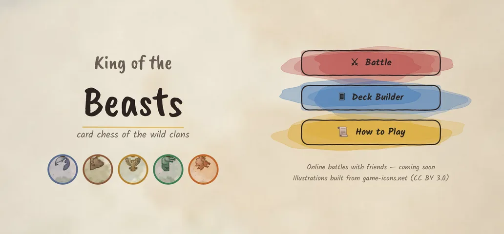
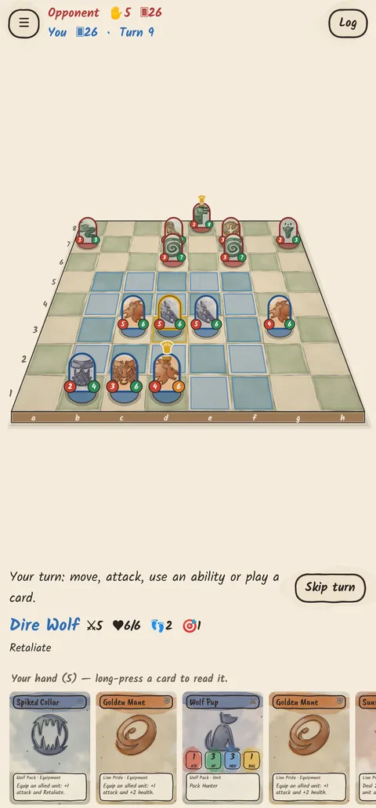
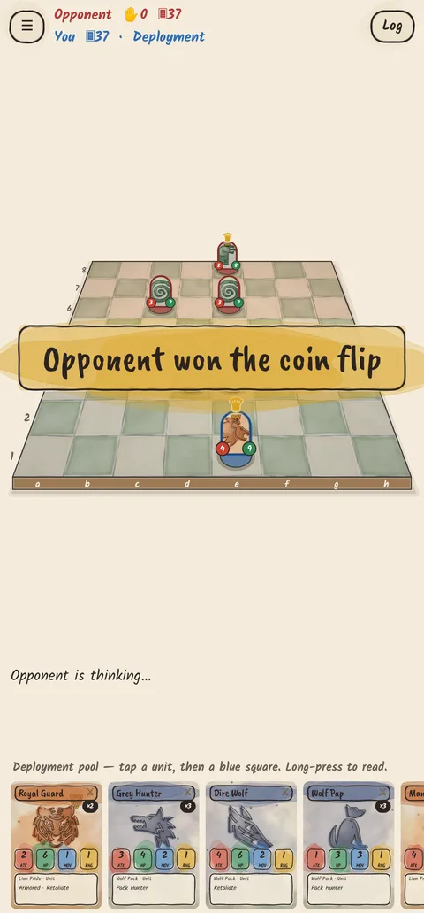
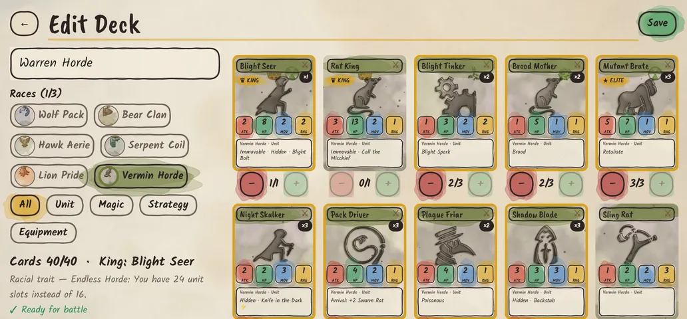
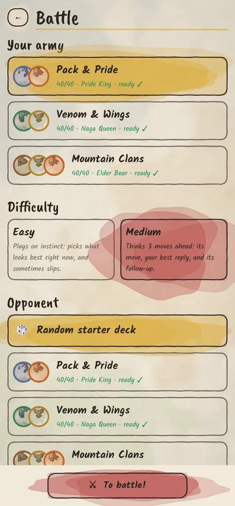
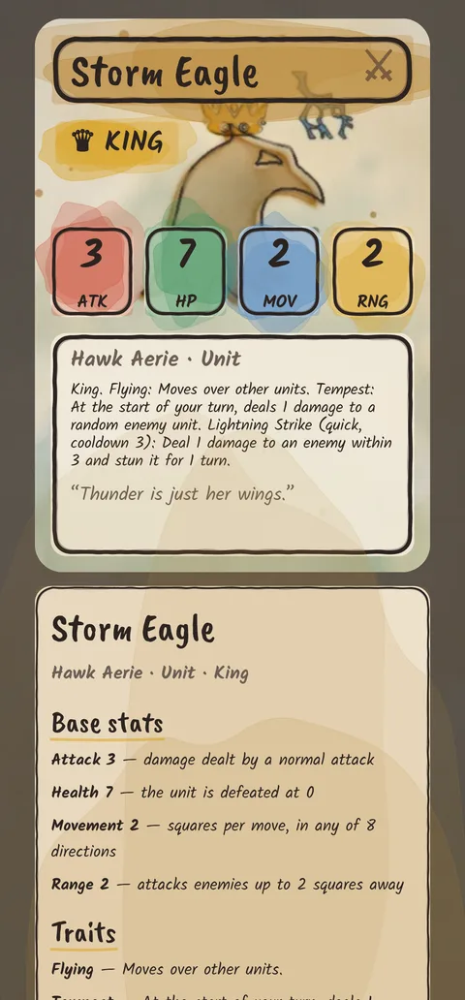
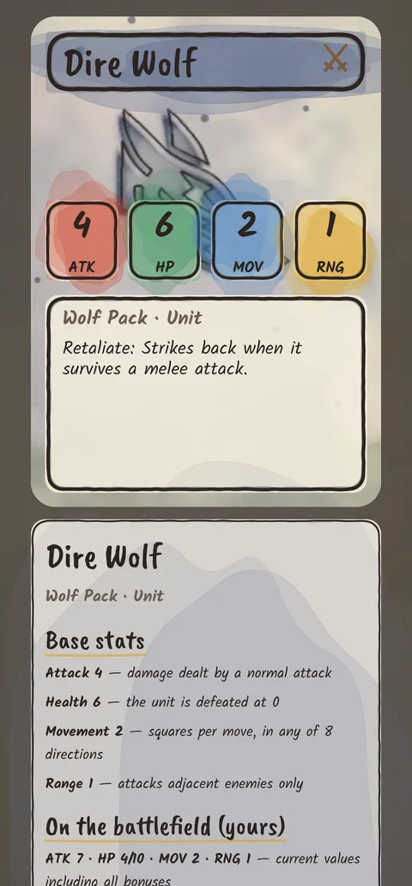
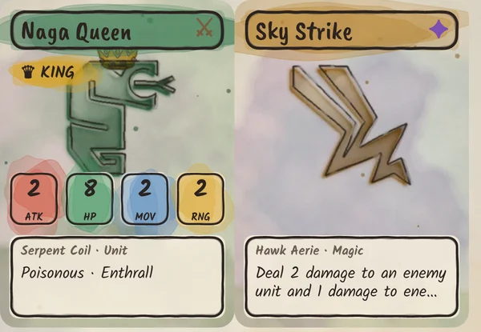

# King of the Beasts

A 2.5D card–chess hybrid for Android. Build a 40-card deck from up to three animal
races, deploy your army on a chessboard, and battle to bring down the enemy King.
The art is hand-drawn ink over watercolor washes.

> Status: **playable MVP**. You play against the computer (Easy or Medium). Online battles with friends are planned next.

<p>




</p>
<p>



</p>


## How to play

| | |
|---|---|
| **Goal** | Kill the enemy King. If your King dies, you lose. |
| **Deck** | 40 cards, 1–3 races, **exactly one King**, at most 3 copies of other cards. |
| **Card types** | **Unit** (a piece on the board), **Magic** (buff, heal, damage, stun, counter — usable as interrupts), **Strategy** (field-wide rule changes for a few turns), **Equipment** (permanent unit upgrades). |
| **Deployment** | Coin flip picks who starts. Players alternate placing one unit in their **first 3 rows**, up to 5 each. The King is always placed first. Units are chosen from all unit cards in the deck. Then everyone shuffles and draws 5. |
| **Battle** | Draw a card, then take **one** action: move, attack, use a unit ability, or play a card. Movement is up to MOV steps in 8 directions (flyers pass over units); range counts diagonals. |
| **Reinforcements** | Unit cards played in battle go on an empty **edge** square at least **2 squares** from every enemy. |
| **Interrupts** | Any action can be answered with a Magic card or a ⚡ quick ability. The other player can answer that, and so on. The chain then resolves last-in-first-out, and actions that no longer make sense fizzle. |
| **Inspecting** | Press and hold any card (in your hand, in the deck builder) or any unit on the board. It opens large, with every trait, ability, target, range and cooldown spelled out. Units also show their live stats and effects. |
| **Opponents** | **Easy** plays on instinct and sometimes misses chances to interrupt. **Medium** thinks 3 moves ahead: its move, your best reply, and its follow-up. |

### Races and their Kings

| Race | Style | King 1 | King 2 |
|---|---|---|---|
| 🐺 Wolf Pack | speed, pack attacks | **Alpha Wolf** – *Call the Pack*: summons Wolf Pups | **Moon Howler** – *Bloodthirst*: every enemy death heals it and adds +1 attack |
| 🐻 Bear Clan | toughness, regeneration | **Elder Bear** – *Unstoppable*: can't be stunned, takes ≤3 per hit; *Earthshaker Roar* | **Cave Warden** – *Guardian*: adjacent allies take 1 less damage; regenerates |
| 🦅 Hawk Aerie | flying, range | **Sky Sovereign** – *Change of Winds*: instantly swap places with any ally (interrupt!) | **Storm Eagle** – *Tempest* zaps a random enemy every turn; *Lightning Strike* stun |
| 🐍 Serpent Coil | poison, denial | **Naga Queen** – *Enthrall*: steal a weakened enemy unit | **Basilisk** – *Petrifying Gaze*: everything it bites is stunned |
| 🦁 Lion Pride | leadership, buffs | **Pride King** – *Commander*: allies within 2 get +1 attack | **Lioness Queen** – *Pounce*: leap across the board and strike |

## Project layout

```
core/        Pure Kotlin rules engine (no Android): cards, deck rules, game engine, AI. JVM unit tests.
app/         Android app (Jetpack Compose): menus, deck builder, 2.5D battle screen.
tools/art/   Python generator for the watercolor card art, board texture and launcher icon.
docs/        Design notes and plan.
```

* **Engine** (`core/.../game/GameEngine.kt`): deterministic and action-based. The same seed and the same
  actions always produce the same game, which is what online play and replays will build on.
* **AI** (`core/.../ai`): positions are scored on material, King safety, next-turn threats and board advance.
  *Easy* picks the best-looking action one step ahead, with some noise. *Medium* runs a 3-ply alpha-beta
  search (its action → your reply → its action) over the most promising candidates at each level. It
  doesn't peek at your hand: when predicting your reply it only considers board actions. Both interrupt
  only when it clearly pays off. A test checks that Medium beats Easy.
* **2.5D board** (`app/.../game/BoardView.kt`): a perspective projection of the board plane. The watercolor
  board texture is mapped with a homography, units are upright card standees sorted by depth, and taps
  are mapped back through the inverse projection.
* **Cards** (`core/.../data/CardDatabase.kt`): all 75 cards are data. New cards are usually one line,
  built from the effect primitives in `model/Cards.kt`.

## Building

Requirements: JDK 17+ and the Android SDK (API 35).

```bash
./gradlew :core:test            # rules engine tests (incl. AI-vs-AI soak test)
./gradlew :app:assembleDebug    # APK at app/build/outputs/apk/debug/app-debug.apk
```

## CI/CD (GitHub Actions)

`.github/workflows/android.yml`:

* **Every push and pull request** runs the engine unit tests and Android lint, then builds a debug APK.
  The APK is attached to the workflow run as an artifact you can download and install.
* **Pushing a tag `vX.Y.Z`** builds a release APK and publishes it as a GitHub Release.
  To sign it with your own key, add these repository secrets:
  `ANDROID_KEYSTORE_BASE64` (`base64 -w0 release.jks`), `ANDROID_KEYSTORE_PASSWORD`,
  `ANDROID_KEY_ALIAS`, `ANDROID_KEY_PASSWORD`. Without them the release APK is signed with a debug key,
  which is fine for testing but not for the Play Store.
* Dependabot keeps Gradle dependencies and Actions up to date.

```bash
git tag v0.1.0 && git push origin v0.1.0   # cut a release
```

## Art

Card illustrations are generated by `tools/art/generate.py`. It paints silhouettes from
[game-icons.net](https://game-icons.net) (CC BY 3.0, via the `@iconify-json/game-icons` npm package)
with ink outlines and layered watercolor washes on paper. To use real paintings instead, drop a
`art_<card id>.webp` into `app/src/main/res/drawable-nodpi/`; it replaces the generated one.

```bash
pip install pillow numpy scipy cairosvg
npm pack @iconify-json/game-icons && tar xzf iconify-json-game-icons-*.tgz
python3 tools/art/generate.py package/icons.json
```

## Credits

* Icons: game-icons.net contributors (Lorc, Delapouite and others), CC BY 3.0.
* Fonts: Kalam and Caveat Brush, SIL Open Font License (`licenses/OFL-fonts.txt`).
